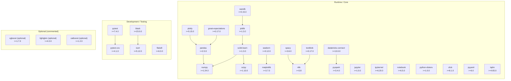

# Project Dependencies

This file documents the project dependencies declared in `requirements.txt` and provides a Mermaid diagram grouping runtime and development/test dependencies.

## Runtime / Core dependencies
- pandas >= 2.0.0
- numpy >= 1.24.0
- scikit-learn >= 1.3.0
- scipy >= 1.10.0
- matplotlib >= 3.7.0
- seaborn >= 0.12.0
- plotly >= 5.15.0
- nltk >= 3.8
- spacy >= 3.6.0
- textblob >= 0.17.0
- wandb >= 0.15.0
- joblib >= 1.3.0
- jupyter >= 1.0.0
- ipykernel >= 6.20.0
- notebook >= 6.5.0
- databricks-connect >= 13.0.0
- pyspark >= 3.4.0
- great-expectations >= 0.17.0
- python-dotenv >= 1.0.0
- click >= 8.1.0
- pyyaml >= 6.0
- tqdm >= 4.65.0

## Development / Testing / Formatting tools
- pytest >= 7.4.0
- pytest-cov >= 4.1.0
- black >= 23.0.0
- flake8 >= 6.0.0
- isort >= 5.12.0

## Optional (commented in `requirements.txt`)
- xgboost >= 1.7.0 (optional)
- lightgbm >= 4.0.0 (optional)
- catboost >= 1.2.0 (optional)

---

## Mermaid dependency diagram
Paste the block below into a Mermaid renderer (GitHub, VS Code Mermaid preview, Mermaid Live Editor) to visualize the grouping and high-level associations.

---

If you'd like this diagram exported to PNG/SVG, I can render it locally if you allow running a renderer or provide a preferred output format.
