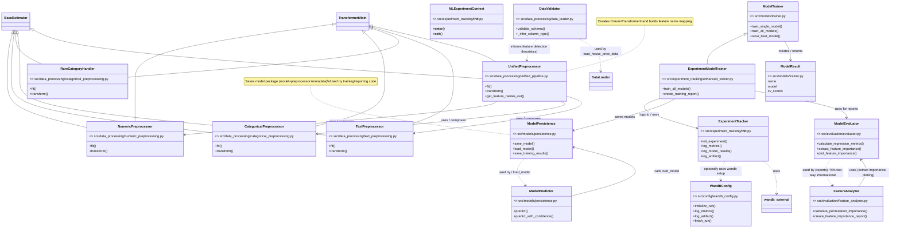

```mermaid
classDiagram
  %% Classes and files
  class WandBConfig {
    <<module>> src/config/wandb_config.py
    +initialize_run()
    +log_metrics()
    +log_artifact()
    +finish_run()
  }

  class DataValidator {
    <<module>> src/data_processing/data_loader.py
    +validate_schema()
    +_infer_column_type()
  }

  class NumericPreprocessor {
    <<module>> src/data_processing/numeric_preprocessing.py
    +fit()
    +transform()
  }

  class CategoricalPreprocessor {
    <<module>> src/data_processing/categorical_preprocessing.py
    +fit()
    +transform()
  }

  class RareCategoryHandler {
    <<module>> src/data_processing/categorical_preprocessing.py
    +fit()
    +transform()
  }

  class TextPreprocessor {
    <<module>> src/data_processing/text_preprocessing.py
    +fit()
    +transform()
  }

  class UnifiedPreprocessor {
    <<module>> src/data_processing/unified_pipeline.py
    +fit()
    +transform()
    +get_feature_names_out()
  }

  class ModelResult {
    <<dataclass>> src/models/trainer.py
    name
    model
    cv_scores
  }

    

    class ModelTrainer {
        <<module>> src/models/trainer.py
        +train_single_model()
        +train_all_models()
        +save_best_model()
    }

    class ModelPersistence {
        <<module>> src/models/persistence.py
        +save_model()
        +load_model()
        +save_training_results()
    }

    class ModelPredictor {
        <<module>> src/models/persistence.py
        +predict()
        +predict_with_confidence()
    }

    class FeatureAnalyzer {
        <<module>> src/evaluation/feature_analyzer.py
        +calculate_permutation_importance()
        +create_feature_importance_report()
    }

    class ModelEvaluator {
        <<module>> src/evaluation/evaluator.py
        +calculate_regression_metrics()
        +extract_feature_importance()
        +plot_feature_importance()
    }

    class ExperimentModelTrainer {
        <<module>> src/experiment_tracking/enhanced_trainer.py
        +train_all_models()
        +create_training_report()
    }

    class ExperimentTracker {
        <<module>> src/experiment_tracking/__init__.py
        +init_experiment()
        +log_metrics()
        +log_model_results()
        +log_artifact()
    }

    class MLExperimentContext {
        <<module>> src/experiment_tracking/__init__.py
        +__enter__()
        +__exit__()
    }

    %% Inheritance / mixins (sketched)
    %% These are sklearn base classes (not shown as files), indicate the inheritance for transformers
    class BaseEstimator
    class TransformerMixin

    BaseEstimator <|-- NumericPreprocessor
    TransformerMixin <|-- NumericPreprocessor

    BaseEstimator <|-- CategoricalPreprocessor
    TransformerMixin <|-- CategoricalPreprocessor

    BaseEstimator <|-- RareCategoryHandler
    TransformerMixin <|-- RareCategoryHandler

    BaseEstimator <|-- TextPreprocessor
    TransformerMixin <|-- TextPreprocessor

    BaseEstimator <|-- UnifiedPreprocessor
    TransformerMixin <|-- UnifiedPreprocessor

    %% Trainer inheritance
    ModelTrainer <|-- ExperimentModelTrainer

    %% Composition / "has-a"
    UnifiedPreprocessor --> NumericPreprocessor : uses / composes
    UnifiedPreprocessor --> CategoricalPreprocessor : uses / composes
    UnifiedPreprocessor --> TextPreprocessor : uses / composes

    ModelTrainer --> ModelResult : creates / returns
    ExperimentModelTrainer --> ExperimentTracker : logs to / uses
    ExperimentModelTrainer --> ModelPersistence : saves models
    ExperimentModelTrainer --> ModelEvaluator : uses for reports

    ModelPersistence ..> ModelPredictor : used by / load_model
    ModelPredictor --> ModelPersistence : calls load_model

    FeatureAnalyzer --> ModelEvaluator : uses (extract importance, plotting)
    ModelEvaluator ..> FeatureAnalyzer : used by (reports)  %% two-way informational

    ExperimentTracker ..> WandBConfig : optionally uses wandb setup
    ExperimentTracker ..> wandb_external : uses

    %% Usage relationships
    DataValidator ..> UnifiedPreprocessor : informs feature detection (heuristics)
    DataValidator ..> DataLoader : used by load_house_price_data

    %% Grouping and notes
    note for UnifiedPreprocessor "Creates ColumnTransformer\nand builds feature name mapping"
    note for ModelPersistence "Saves model package (model+preprocessor+metadata)\nUsed by training/reporting code"
```